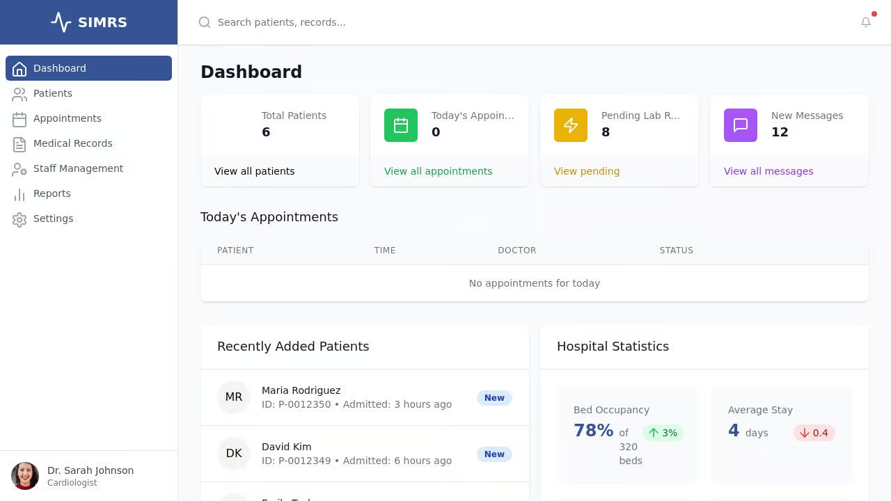

# SIMRS - Hospital Management Information System

SIMRS (Sistem Informasi Manajemen Rumah Sakit) is a comprehensive hospital management information system designed to streamline hospital operations, manage patient data, and facilitate healthcare service delivery. Inspired by MLite.id, this system provides an integrated platform for healthcare providers to efficiently manage various aspects of hospital administration.



## Features

### Current Features

- **Dashboard:** Comprehensive overview of hospital statistics, recent patients, and upcoming appointments
- **Patient Management:**
  - Registration and profile management for patients
  - Patient search and filtering capabilities
  - Medical history tracking
- **Appointment Scheduling:**
  - Calendar-based appointment booking
  - Appointment status tracking
  - Doctor assignment
- **Medical Records:**
  - Digital documentation of patient visits
  - Treatment and diagnosis recording
  - Prescription management
- **Staff Management:**
  - Staff profile management
  - Role-based access control
  - Specialization tracking
- **Reporting:**
  - Statistical reports on hospital operations
  - Patient demographic analysis
  - Appointment and treatment trends

### Planned Features

- **Laboratory Integration:**
  - Lab test requests
  - Results management
  - Sample tracking
- **Electronic Prescriptions:**
  - Digital prescription creation
  - Medication history
  - Drug interaction alerts
- **Billing and Insurance:**
  - Patient billing
  - Insurance claim processing
  - Payment tracking
- **Inventory Management:**
  - Medical supplies tracking
  - Automatic reordering
  - Usage statistics

## Technology Stack

- **Frontend:** React with TypeScript, TailwindCSS, Shadcn UI components
- **Backend:** Node.js with Express
- **State Management:** React Query for server state, React Context for application state
- **Data Storage:** In-memory storage with PostgreSQL integration option
- **Authentication:** Passport.js for user authentication
- **UI Framework:** Responsive design using Tailwind CSS

## Getting Started

### Prerequisites

- Node.js (v16+)
- npm or yarn package manager

### Installation

1. Clone the repository:
   ```
   git clone <repository-url>
   cd simrs
   ```

2. Install dependencies:
   ```
   npm install
   ```

3. Start the development server:
   ```
   npm run dev
   ```

4. Open your browser and navigate to `http://localhost:5000` to access the application.

## Project Structure

- `/client`: Frontend React application
  - `/src/components`: Reusable UI components
  - `/src/pages`: Page components for different routes
  - `/src/lib`: Utility functions and constants
  - `/src/hooks`: Custom React hooks
- `/server`: Backend Express application
  - `/routes.ts`: API route definitions
  - `/storage.ts`: Data storage implementation
- `/shared`: Shared code between frontend and backend
  - `/schema.ts`: Data schema definitions using Drizzle ORM

## API Documentation

The system exposes RESTful APIs for data manipulation:

- `/api/patients`: Patient management endpoints
- `/api/staff`: Staff management endpoints
- `/api/appointments`: Appointment scheduling endpoints
- `/api/medical-records`: Medical record management endpoints
- `/api/hospital-stats`: Hospital statistics endpoints

## Contributing

Contributions are welcome! Please feel free to submit a Pull Request.

## License

This project is licensed under the MIT License - see the LICENSE file for details.

## Acknowledgements

- Inspired by [MLite.id](https://mlite.id)
- UI components from [shadcn/ui](https://ui.shadcn.com/)
- Icons from [Lucide React](https://lucide.dev/)